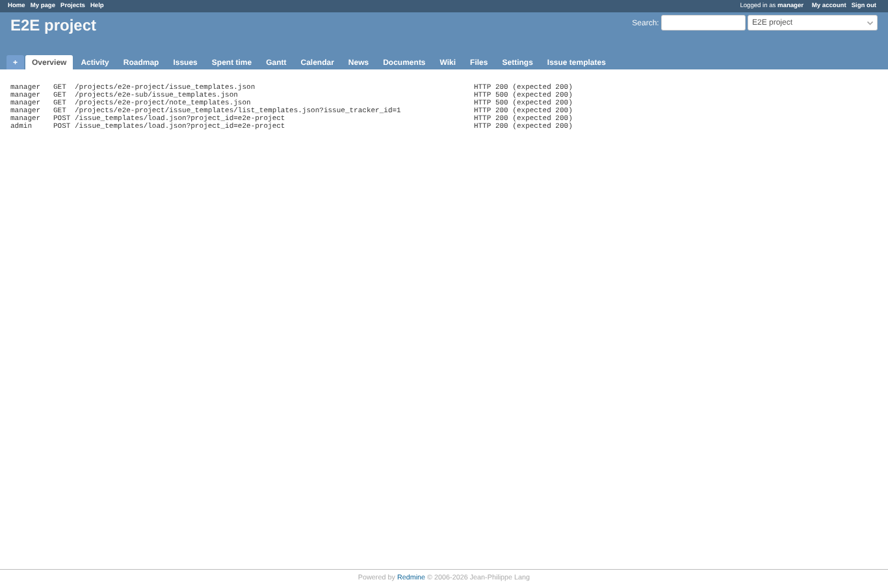
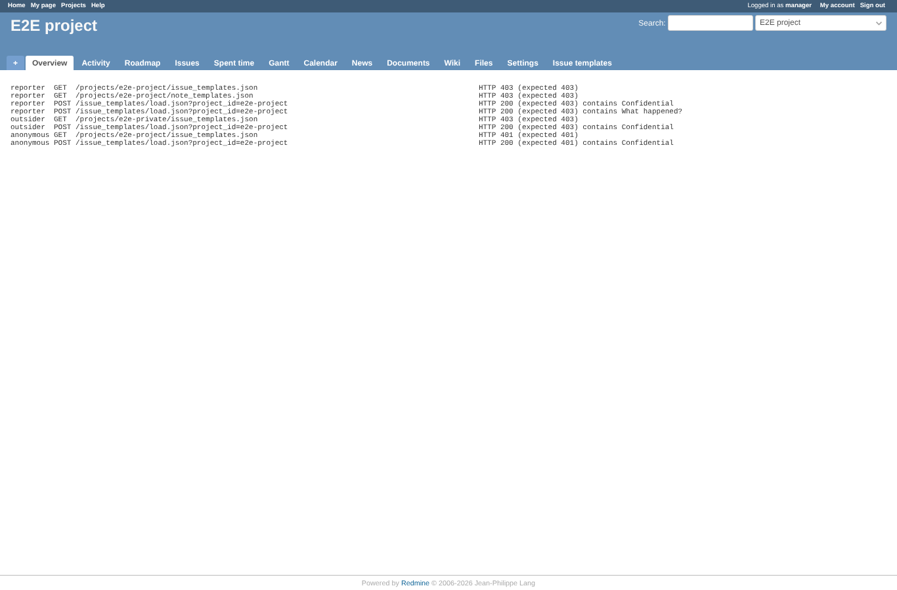

# rest-api

Run 2026-10-06T20:28:13.199Z against http://127.0.0.1:3000.

| screenshot | user | URL | shows |
|---|---|---|---|
|  | manager | `/projects/e2e-project` | With an API key of a member with the permission: the lists (also the inherited templates of the subproject), list_templates and load answer 200 with the templates |
|  | manager | `/projects/e2e-project` | Without the permission, without membership or without a key the same calls are refused (403/401) and return no template text; load used to answer 200 to anyone |

## Problems

- manager GET /projects/e2e-sub/issue_templates.json: HTTP 500, expected 200
- manager GET /projects/e2e-project/note_templates.json: HTTP 500, expected 200
- reporter POST /issue_templates/load.json?project_id=e2e-project: HTTP 200, expected 403
- reporter POST /issue_templates/load.json?project_id=e2e-project: answer contains Confidential
- reporter POST /issue_templates/load.json?project_id=e2e-project: HTTP 200, expected 403
- reporter POST /issue_templates/load.json?project_id=e2e-project: answer contains What happened?
- outsider POST /issue_templates/load.json?project_id=e2e-project: HTTP 200, expected 403
- outsider POST /issue_templates/load.json?project_id=e2e-project: answer contains Confidential
- anonymous POST /issue_templates/load.json?project_id=e2e-project: HTTP 200, expected 401
- anonymous POST /issue_templates/load.json?project_id=e2e-project: answer contains Confidential
