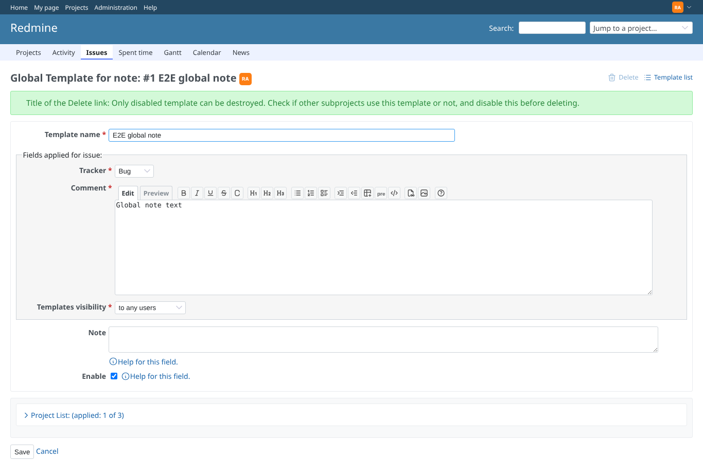
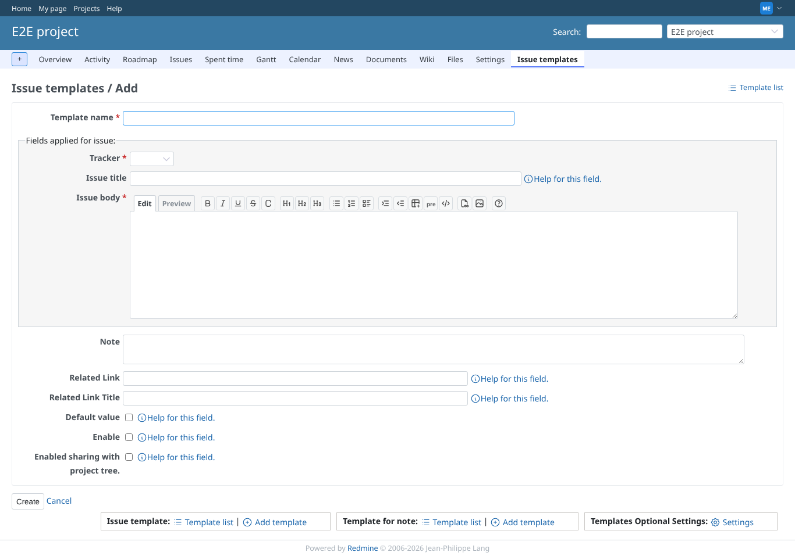
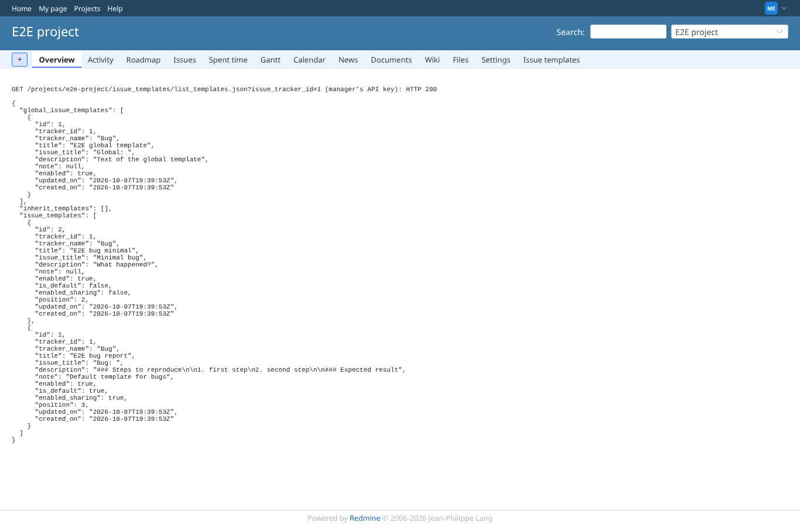
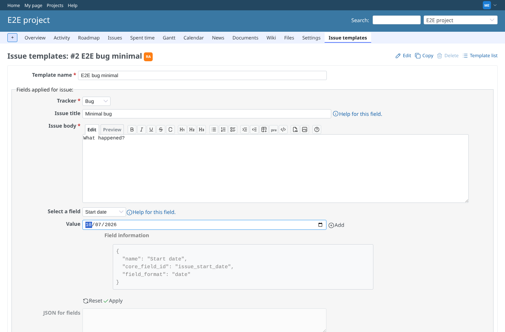
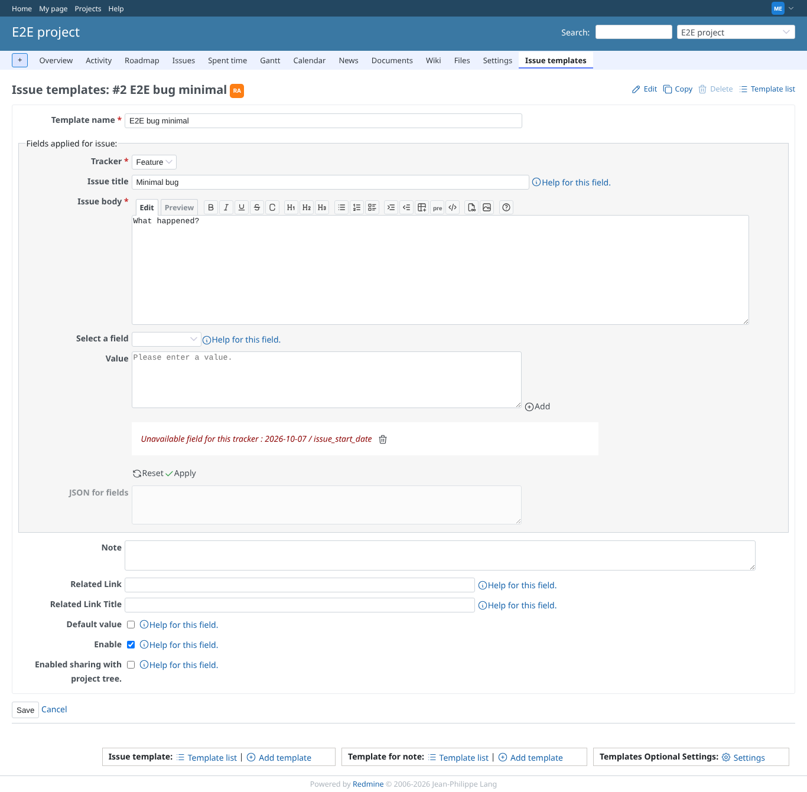
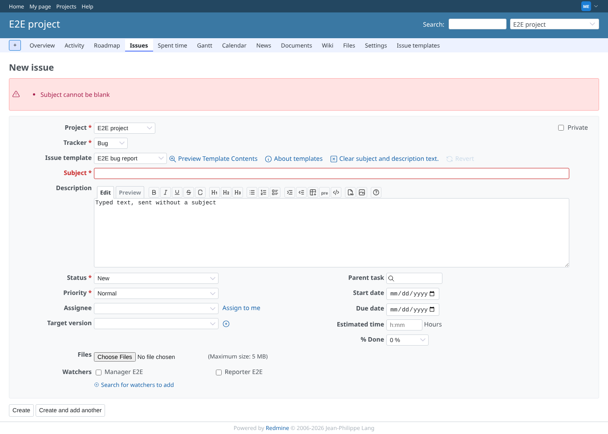
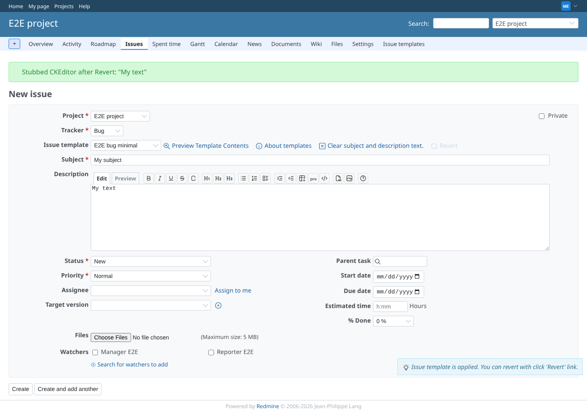

# fixes

Run 2026-10-07T19:42:07.011Z against http://127.0.0.1:3000.

| screenshot | user | URL | shows |
|---|---|---|---|
|  | admin | `/global_note_templates/1` | An enabled global note template: the disabled Delete link carries the explanation as its tooltip (title), shown here under the links |
|  | manager | `/projects/e2e-project/issue_templates/new` | A new template form no longer says "Orphaned template from tracker" before a tracker is chosen |
|  | manager | `/projects/e2e-project` | list_templates.json names the tracker of a global template ("tracker_name": "Bug"); it used to be empty |
|  | manager | `/projects/e2e-project/issue_templates/2` | The built-in field generator offers a date input for Start date (it used to be a text box) |
|  | manager | `/projects/e2e-project/issue_templates/2` | After choosing the tracker Feature, which has no Start date here, the list marks the field unavailable at once |
|  | manager | `/projects/e2e-project/issues` | A new issue without a subject is refused; the description keeps what was sent, the default template is not added to it again |
|  | manager | `/projects/e2e-project/issues/new` | Revert after applying a template: the textarea and a (stubbed) CKEditor both get "My text" back; CKEditor used to keep the template text |
