# global-templates

Run 2026-10-06T20:06:48.624Z against http://127.0.0.1:3000.

| screenshot | user | URL | shows |
|---|---|---|---|
| 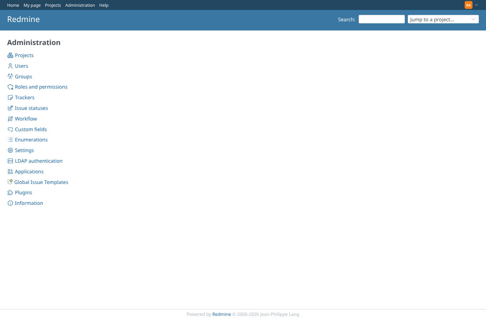 | admin | `/admin` | Administration lists Global Issue Templates (raster icon through legacy-icons-compat on Redmine 7) |
| 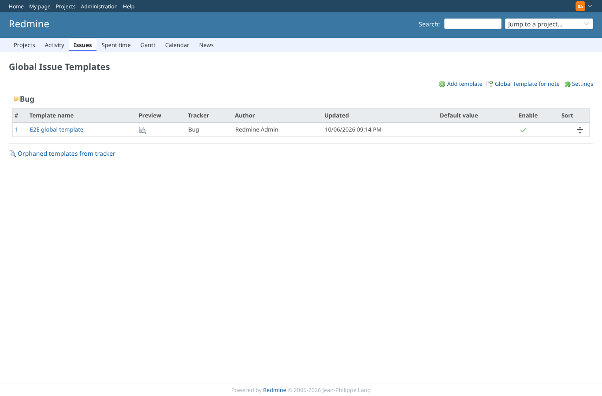 | admin | `/global_issue_templates` | The global issue templates per tracker |
| 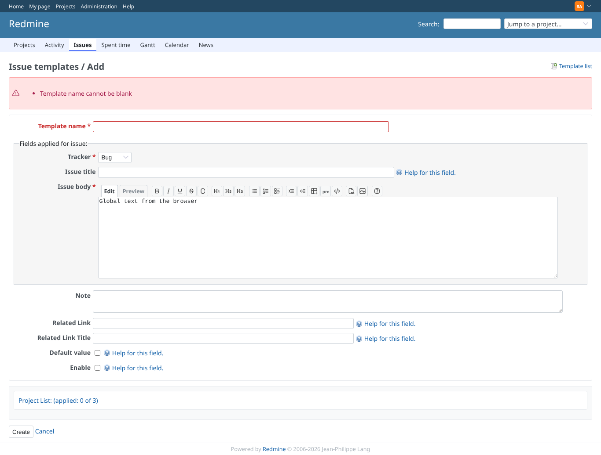 | admin | `/global_issue_templates` | A global template without a name is refused with a validation message |
| 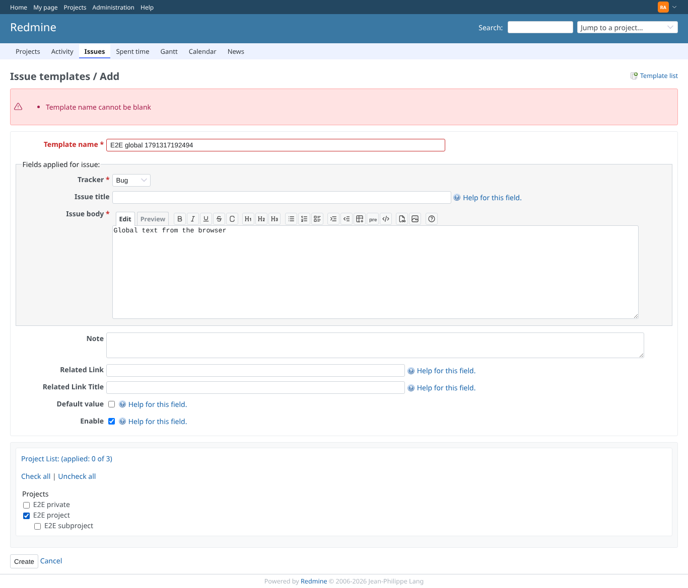 | admin | `/global_issue_templates` | The new global template is enabled and assigned to the E2E project |
| 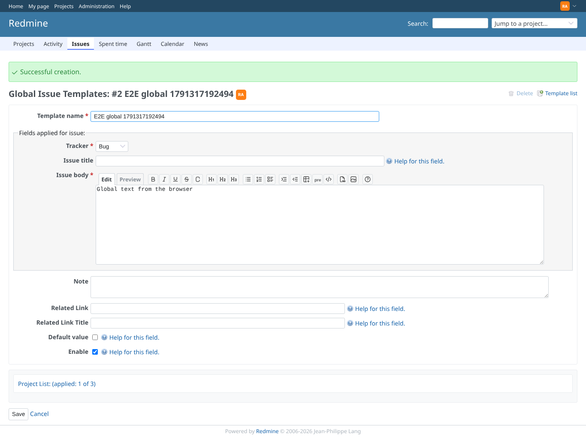 | admin | `/global_issue_templates/2` | The global template is saved |
| 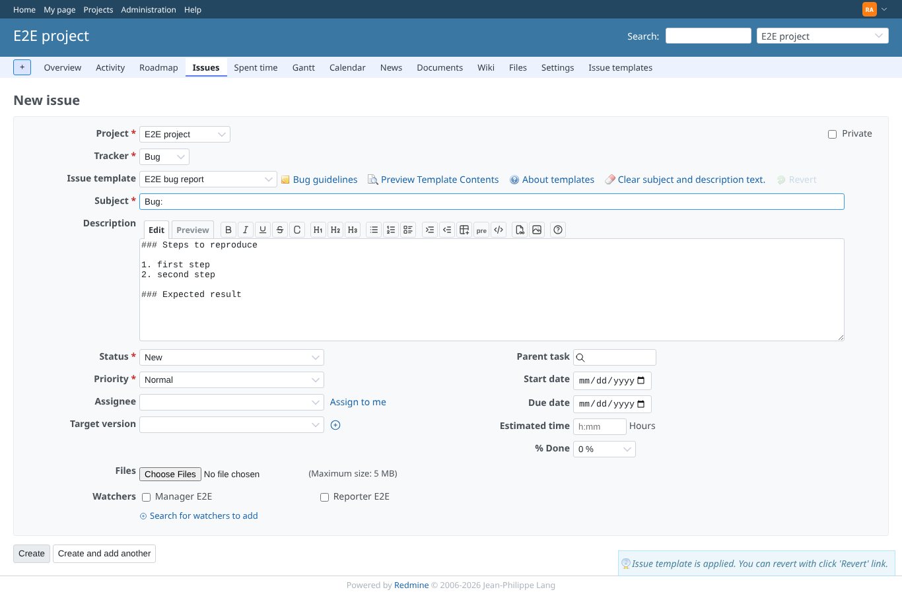 | admin | `/projects/e2e-project/issues/new` | The project's new issue form offers the new global template in its pulldown |
| 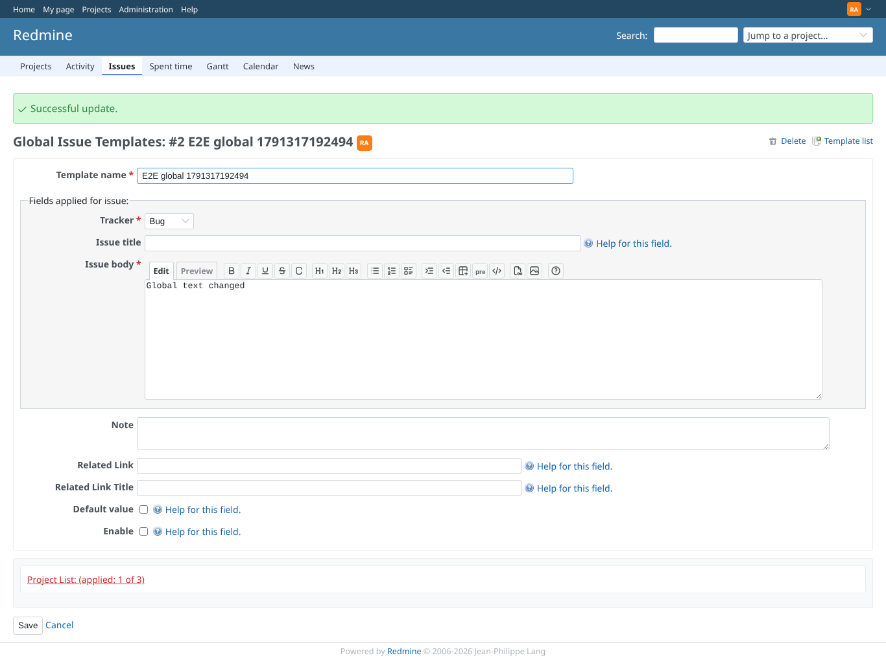 | admin | `/global_issue_templates/2` | Editing saves the change; the template is disabled |
| 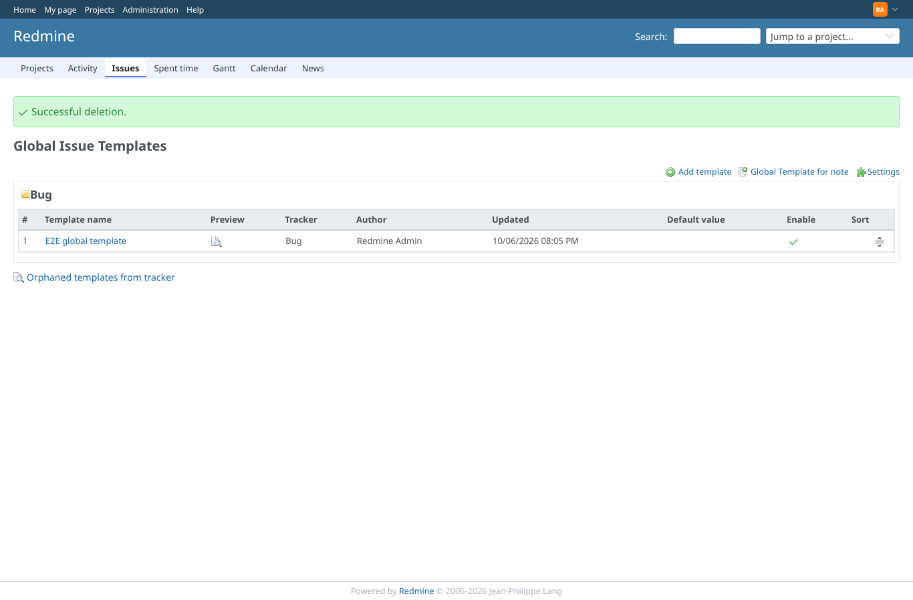 | admin | `/global_issue_templates` | The disabled global template is deleted |
| 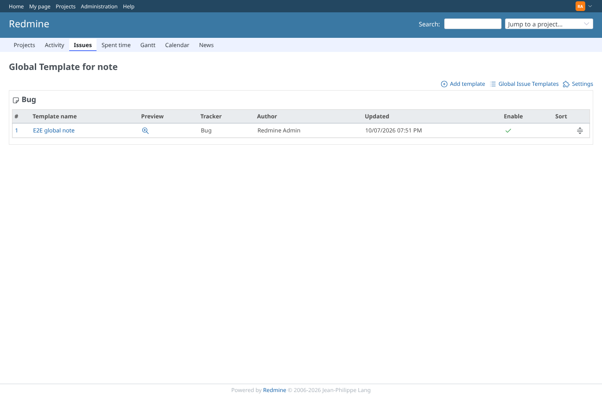 | admin | `/global_note_templates` | The global note templates per tracker |
| 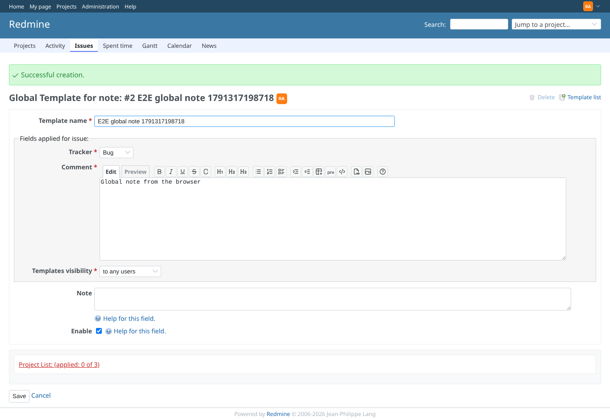 | admin | `/global_note_templates/2` | A global note template is saved |
| 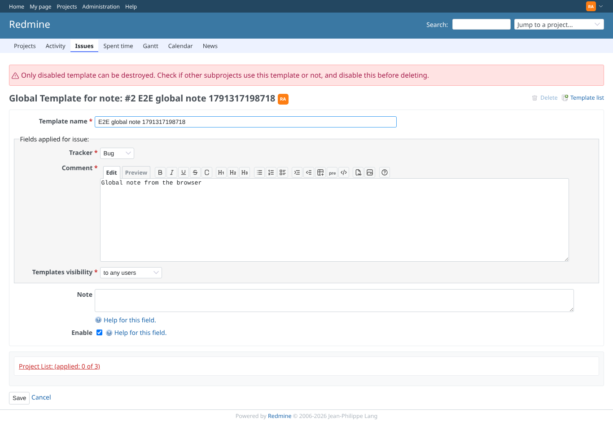 | admin | `/global_note_templates/2` | The Delete link of an enabled global note template is disabled; sending the delete anyway is refused with an error |
| 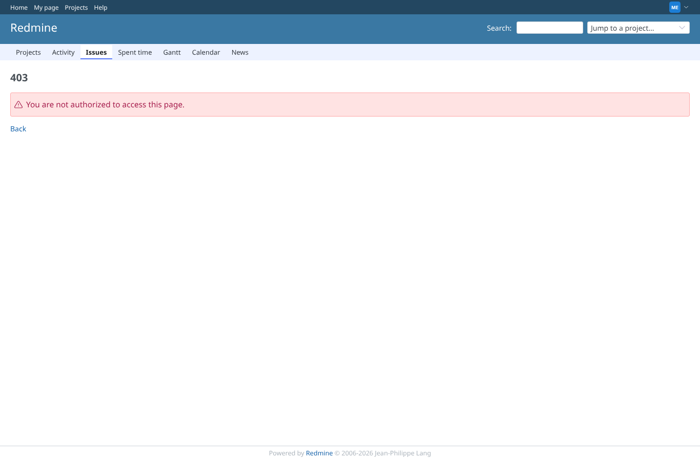 | manager | `/global_issue_templates` | The global template pages are refused to a non-administrator (403) |
|  | manager | `/global_issue_templates` | Creating a global template as a non-administrator is refused (403); this used to succeed |
|  | manager | `/global_note_templates/1` | Changing a global note template as a non-administrator is refused (403); this used to succeed |
|  | reporter | `/global_issue_templates/new` | A reporter is refused too |
| 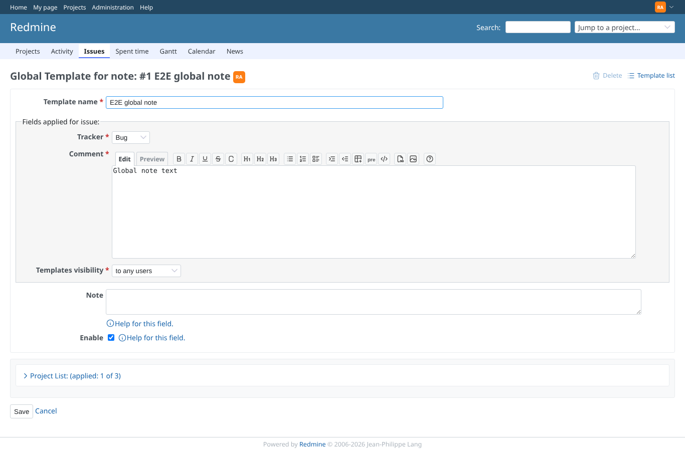 | admin | `/global_note_templates/1` | Afterwards the global templates the manager tried to delete or change are unchanged |
