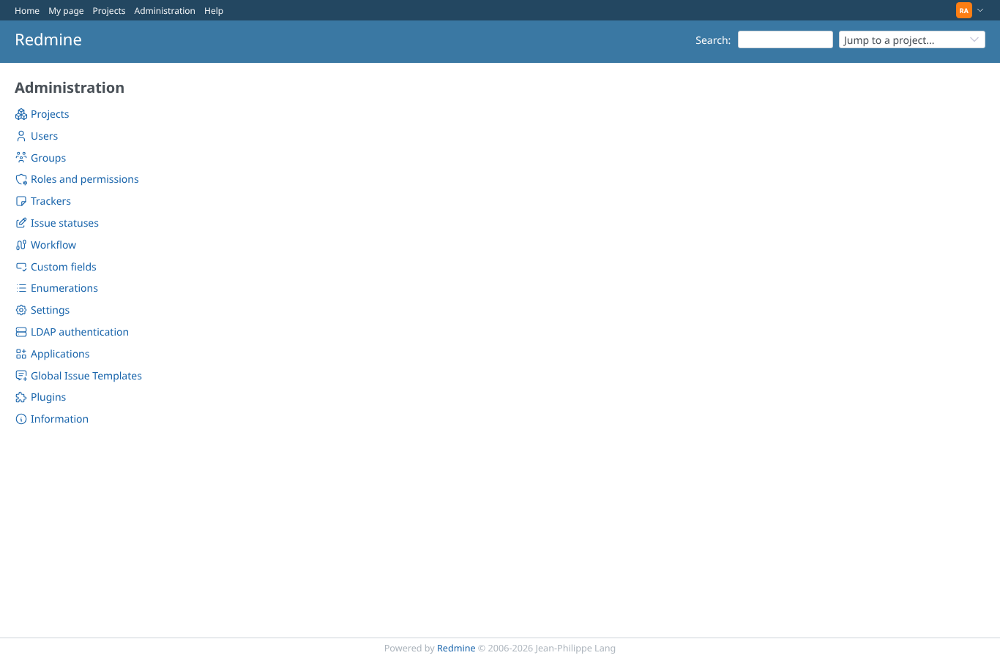
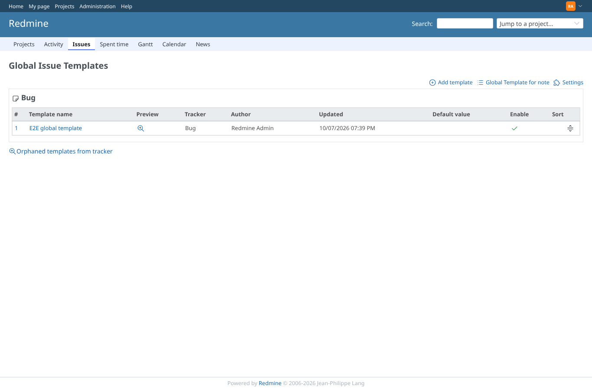
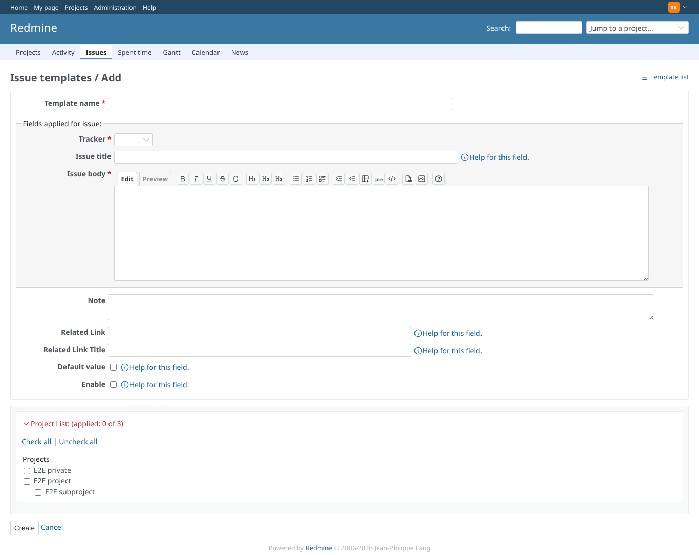
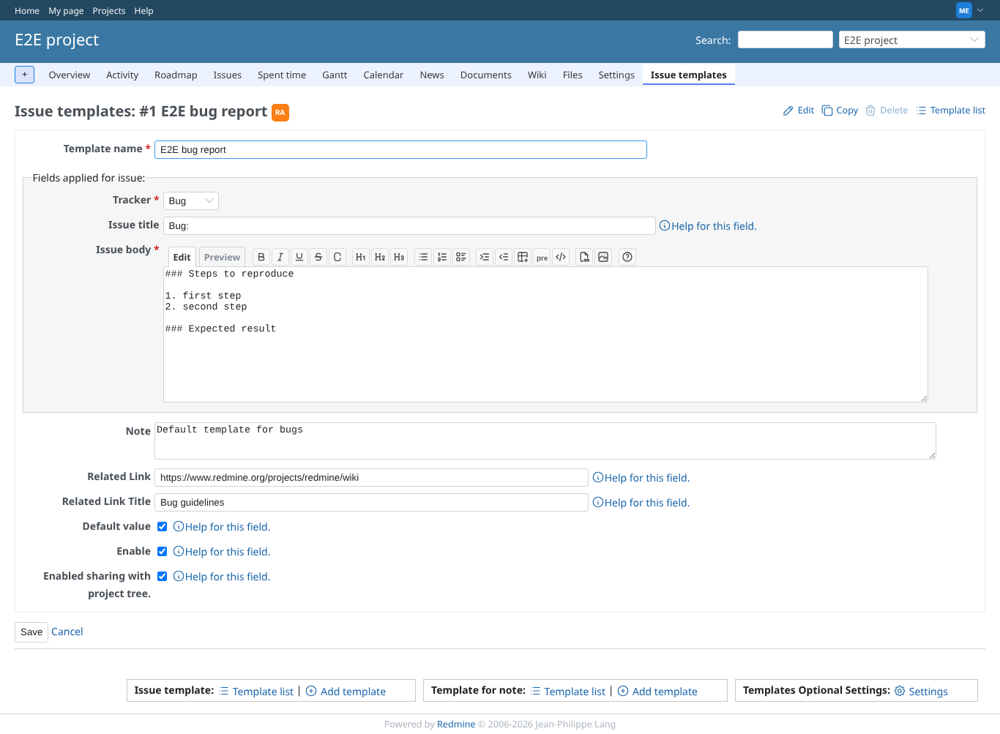
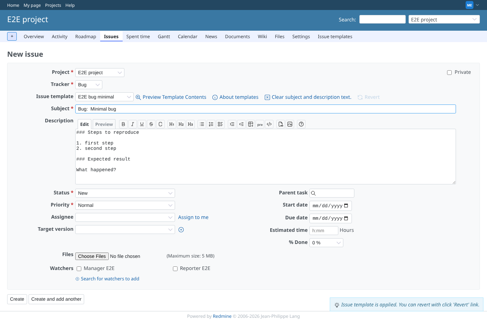
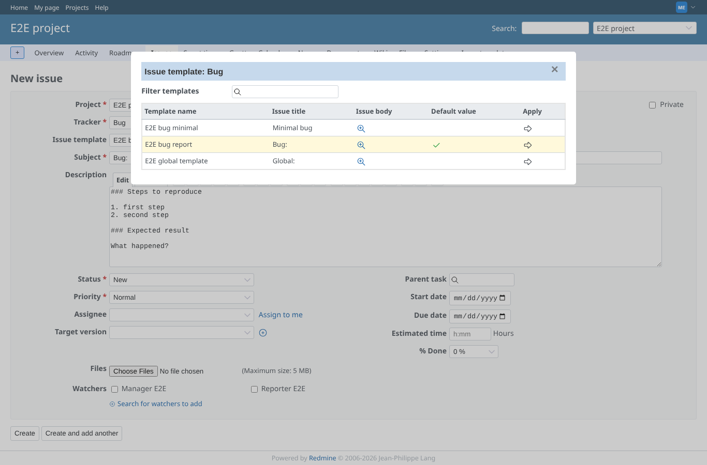
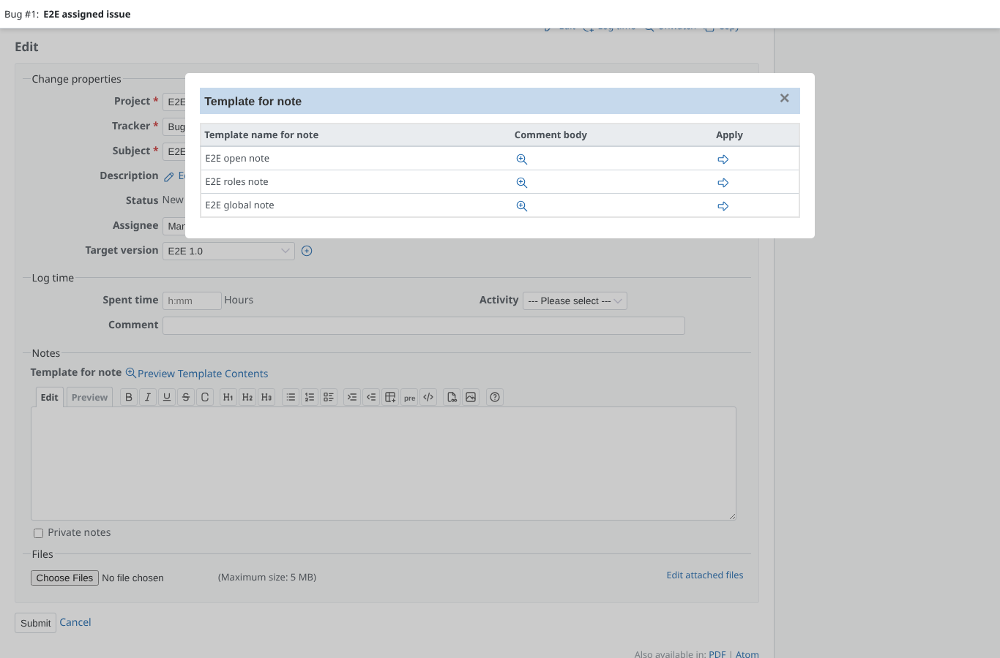
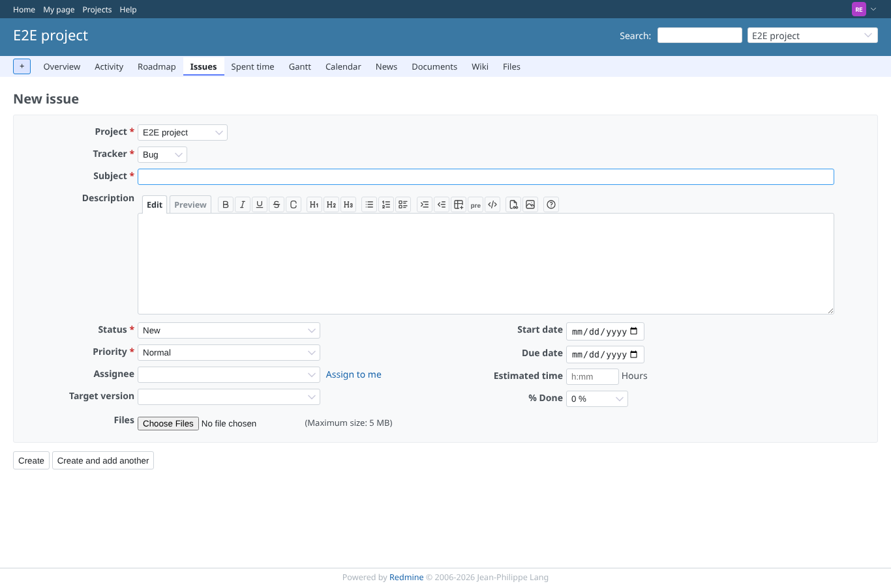

# icons

Run 2026-10-07T19:42:43.527Z against http://127.0.0.1:3000.

| screenshot | user | URL | shows |
|---|---|---|---|
|  | admin | `/admin` | Administration: Global Issue Templates with an SVG icon like the core entries |
|  | admin | `/global_issue_templates` | Global issue templates: add, note templates and settings links, tracker heading and preview icons from the sprite |
|  | admin | `/global_issue_templates/new` | The global template form: help icons from the sprite |
|  | manager | `/projects/e2e-project/issue_templates` | Project template list: tracker headings, preview, sort and the template links with sprite icons |
|  | manager | `/projects/e2e-project/issue_templates/1` | A template: edit, copy, delete (disabled) and list with sprite icons; help icons in the form |
|  | manager | `/projects/e2e-project/issues/new` | The issue form: related link, preview, help, erase and revert icons, and the bulb in the "template applied" message |
|  | manager | `/projects/e2e-project/issues/new#issue_template_dialog` | Clicking the arrow icon in the dialog applies the template (the click lands on the svg, the handler reads the link) |
|  | manager | `/issues/1#template_issue_notes_dialog` | The note template popup: preview and apply icons from the sprite |
|  | reporter | `/projects/e2e-project/issues/new` | Without the permission no template icons or links appear, the template pages are refused (403) |
|  | outsider | `/projects/e2e-private/issue_templates` | A non-member is refused the private project's templates (403) |
