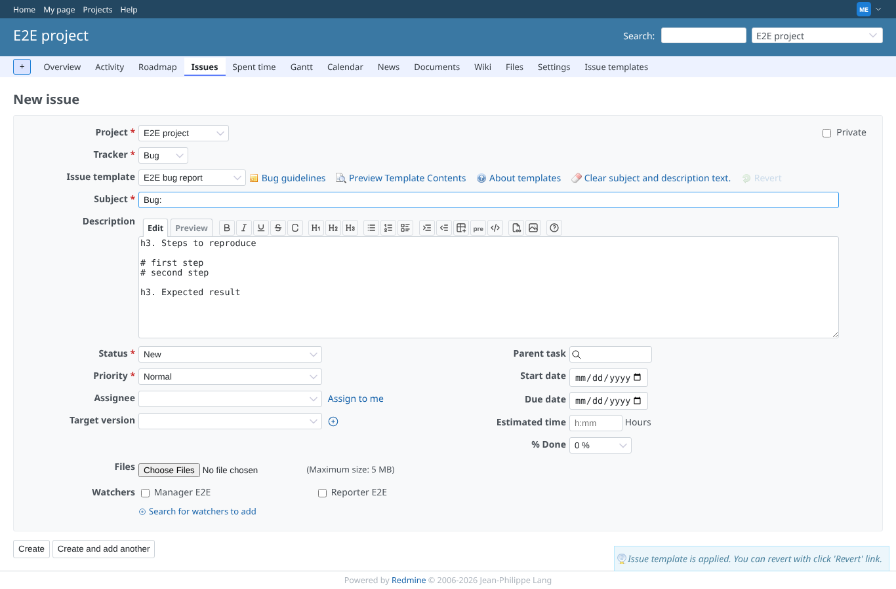
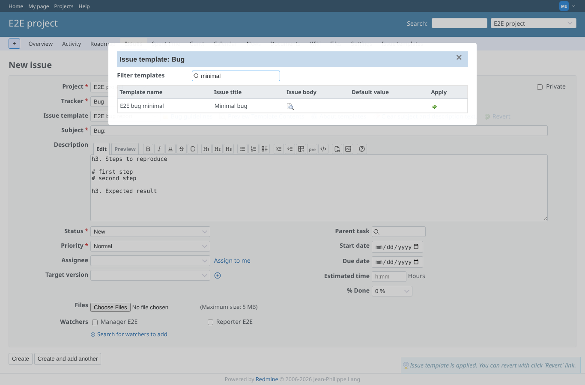
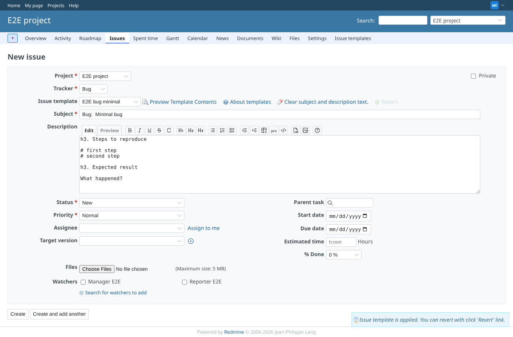
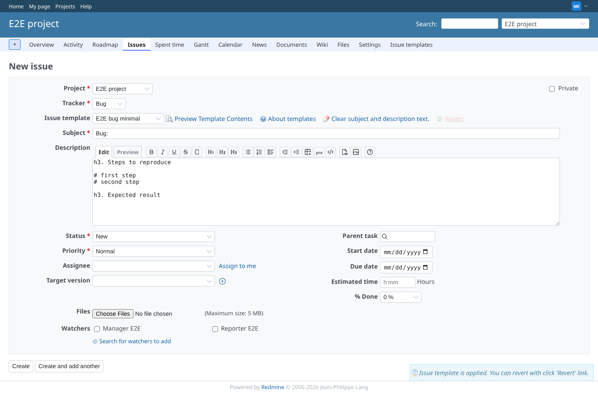
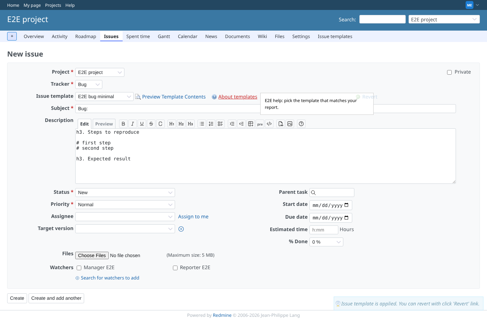
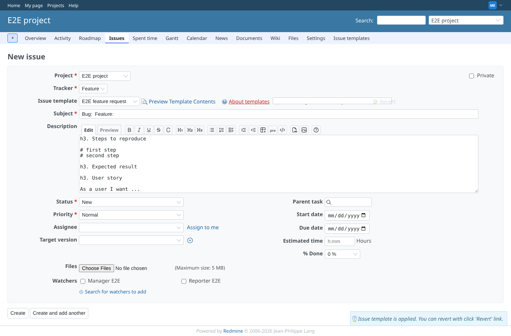
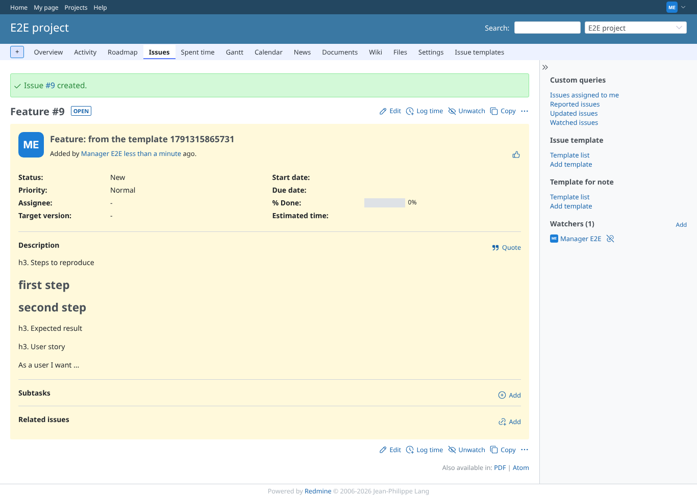
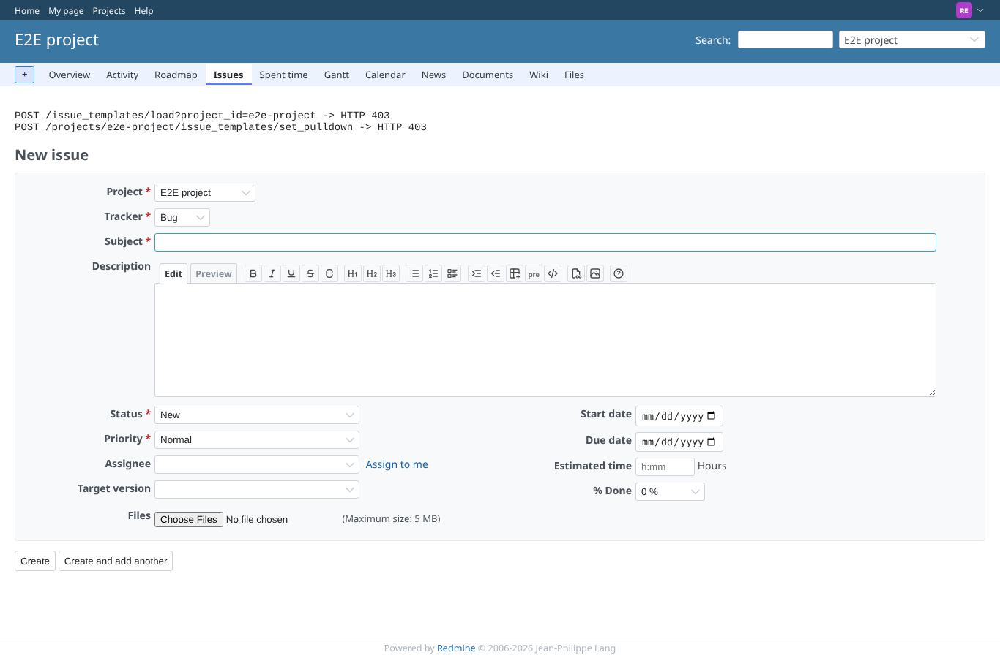

# new-issue-template

Run 2026-10-06T19:44:30.359Z against http://127.0.0.1:3000.

| screenshot | user | URL | shows |
|---|---|---|---|
|  | manager | `/projects/e2e-project/issues/new` | Bug tracker: the default project template is applied on open; the pulldown lists the project and global templates, not the disabled or private ones |
|  | manager | `/projects/e2e-project/issues/new#issue_template_dialog` | The filter dialog lists the templates of the tracker and filters them by name |
|  | manager | `/projects/e2e-project/issues/new#` | Choosing another template appends its subject and description to what is there |
|  | manager | `/projects/e2e-project/issues/new#` | Revert puts back the subject and description from before the last template |
|  | manager | `/projects/e2e-project/issues/new#` | The project help message is shown next to the pulldown |
|  | manager | `/projects/e2e-project/issues/new#` | Switching the tracker to Feature offers the Feature template and applies it |
|  | manager | `/issues/9` | The issue is saved with the text of the template |
|  | reporter | `/projects/e2e-project/issues/new` | Without show_issue_templates the new issue form has no template pulldown |
|  | reporter | `/projects/e2e-project/issues/new` | Loading the private project's template by id, or listing that project's templates through issue_project_id, is refused (HTTP 403, shown at the top) as a reporter |
|  | outsider | `/projects/e2e-private/issues/new` | A non-member gets no new issue form (and no templates) in the private project |
