# note-templates

Run 2026-10-07T17:13:55.398Z against http://127.0.0.1:3000.

| screenshot | user | URL | shows |
|---|---|---|---|
| 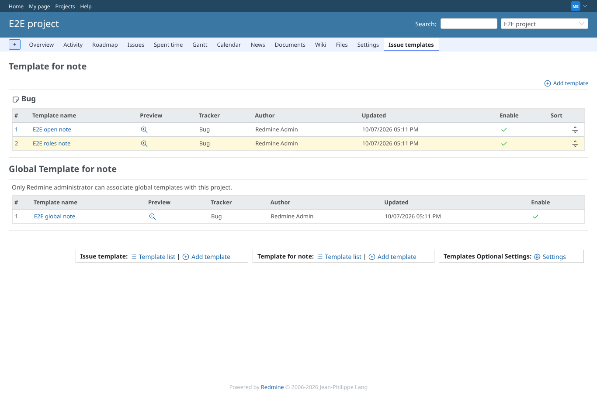 | manager | `/projects/e2e-project/note_templates` | The project's note templates per tracker, with the global note templates below |
| 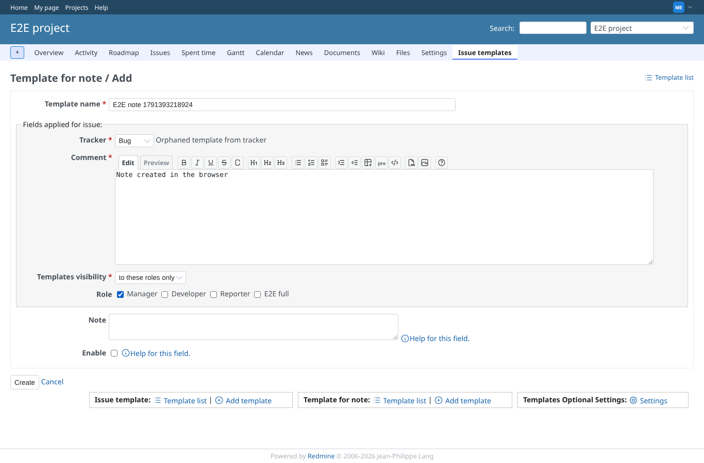 | manager | `/projects/e2e-project/note_templates/new` | A new note template visible to selected roles |
| 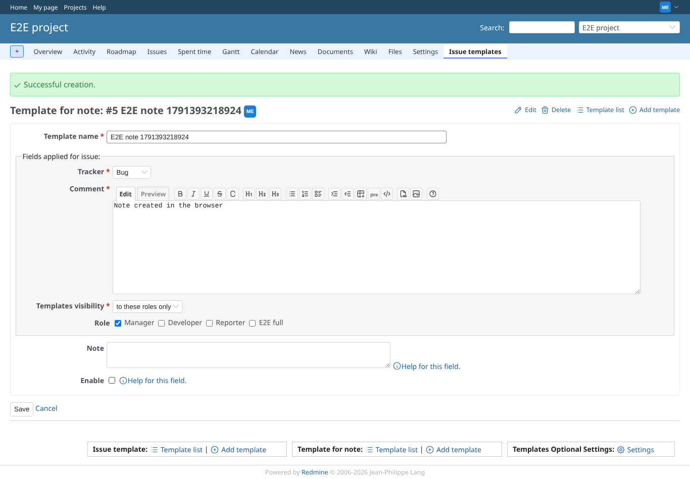 | manager | `/projects/e2e-project/note_templates/5` | The note template is saved with its roles |
|  | manager | `/projects/e2e-project/note_templates/5` | Editing saves the description; the template is disabled |
| 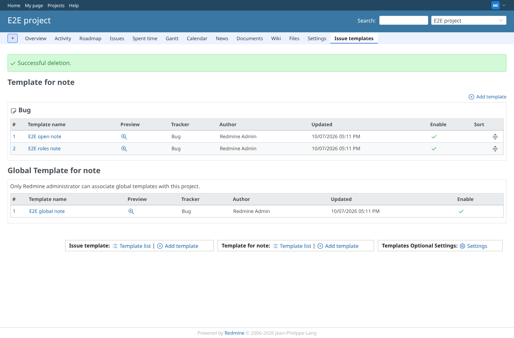 | manager | `/projects/e2e-project/note_templates` | The disabled note template is deleted |
| 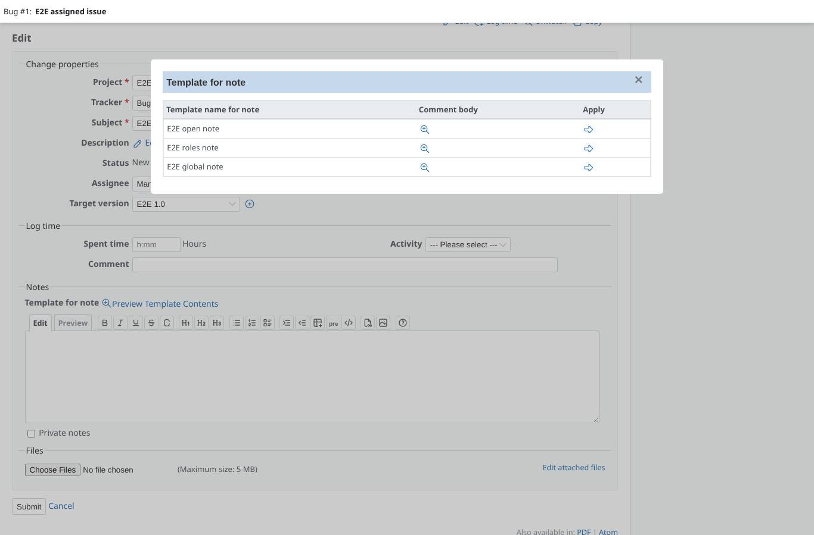 | manager | `/issues/1#template_issue_notes_dialog` | On the issue: the popup offers the open, role and global note templates, not another user's private one |
| 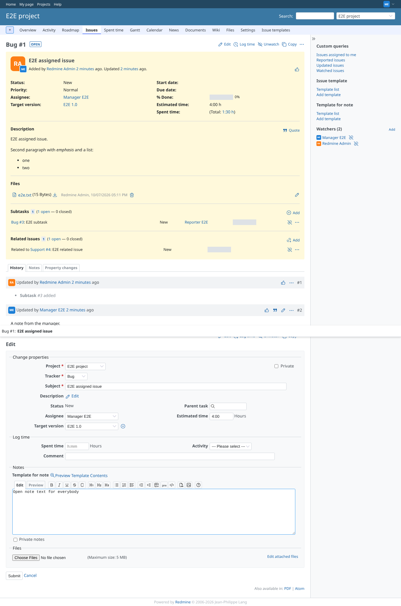 | manager | `/issues/1#template_issue_notes_dialog` | Apply puts the note template text into the notes |
| 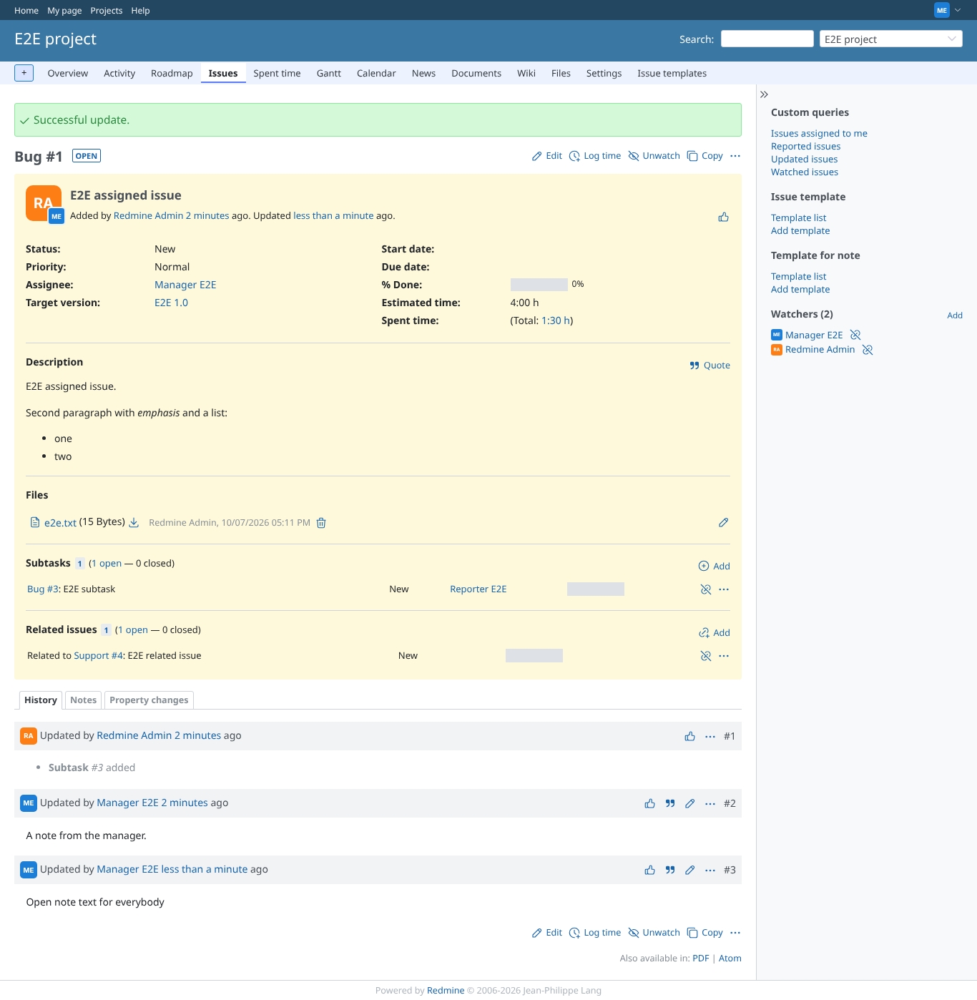 | manager | `/issues/1` | The note from the template is saved in the history |
|  | admin | `/issues/1#template_issue_notes_dialog` | The author also gets the note template only visible to its author |
| 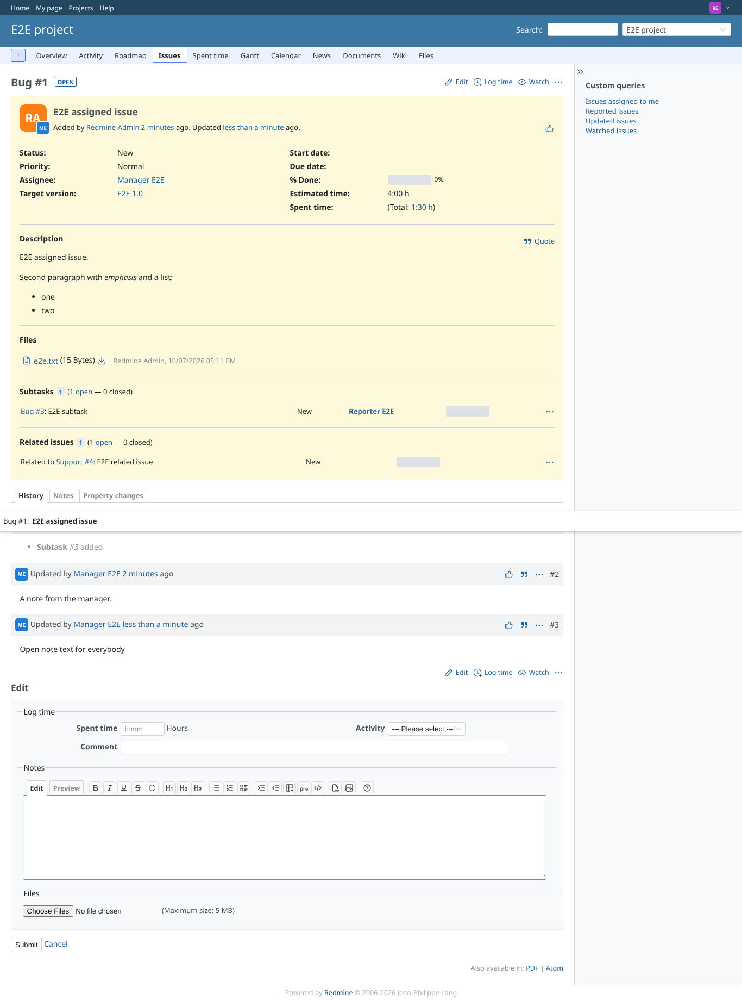 | reporter | `/issues/1` | Without show_issue_templates the edit form has no note template link (it used to open an empty popup with a 403) |
| 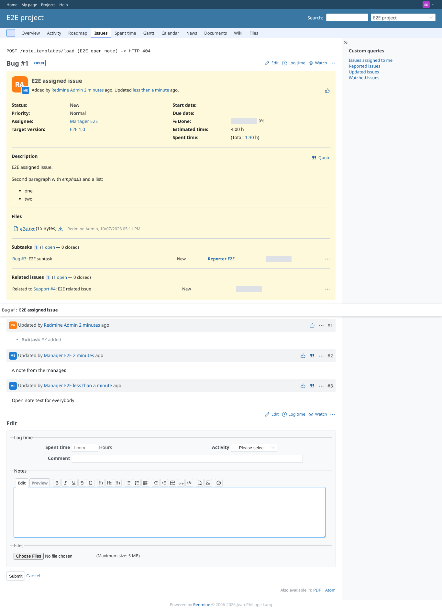 | reporter | `/issues/1` | Loading a note template without the permission is refused (HTTP 404, shown at the top) |
|  | reporter | `/projects/e2e-project/note_templates` | The note template list is refused without the permission (403) |
| 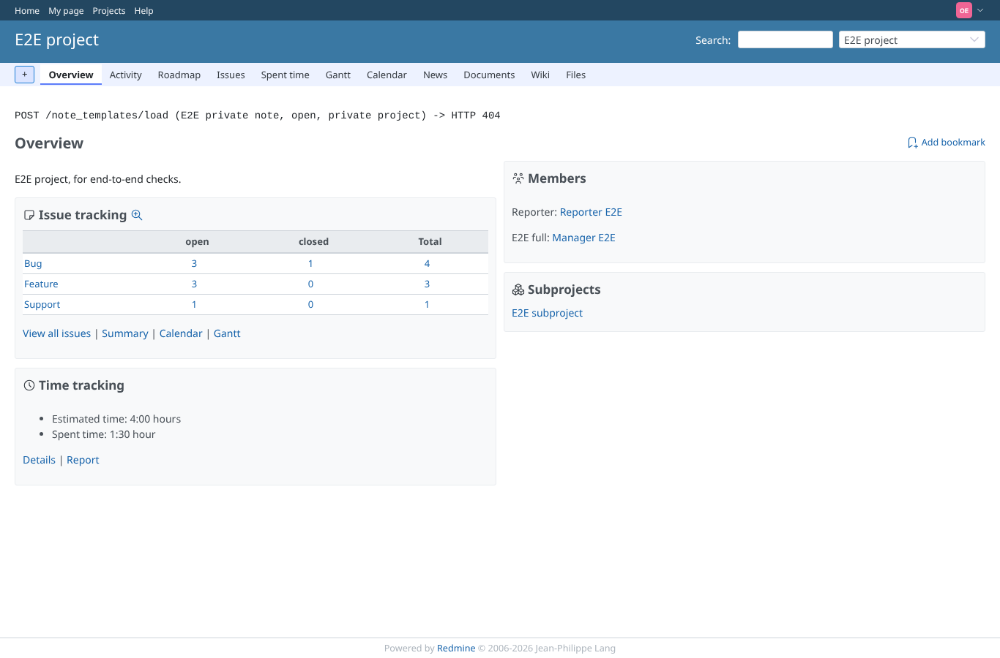 | outsider | `/projects/e2e-project` | An "open" note template of a private project is not given to a non-member (HTTP 404, shown at the top) |
| 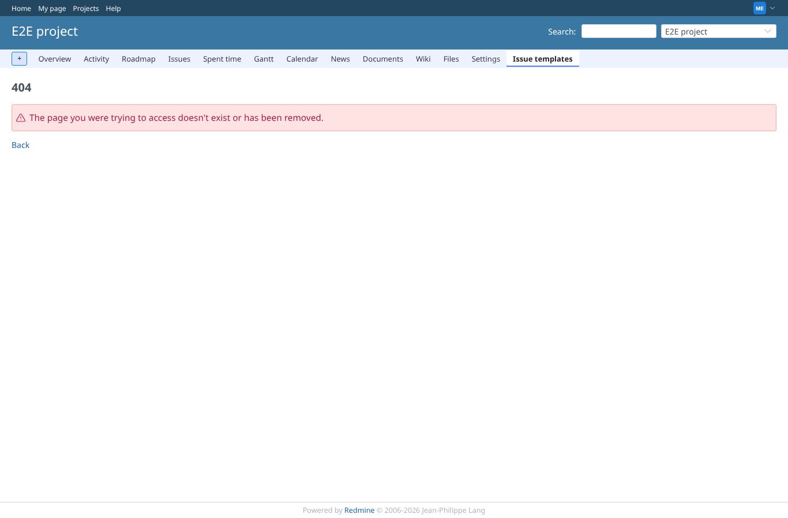 | manager | `/projects/e2e-project/note_templates/4` | A note template of another project is not reachable through this project's URL (404) |
