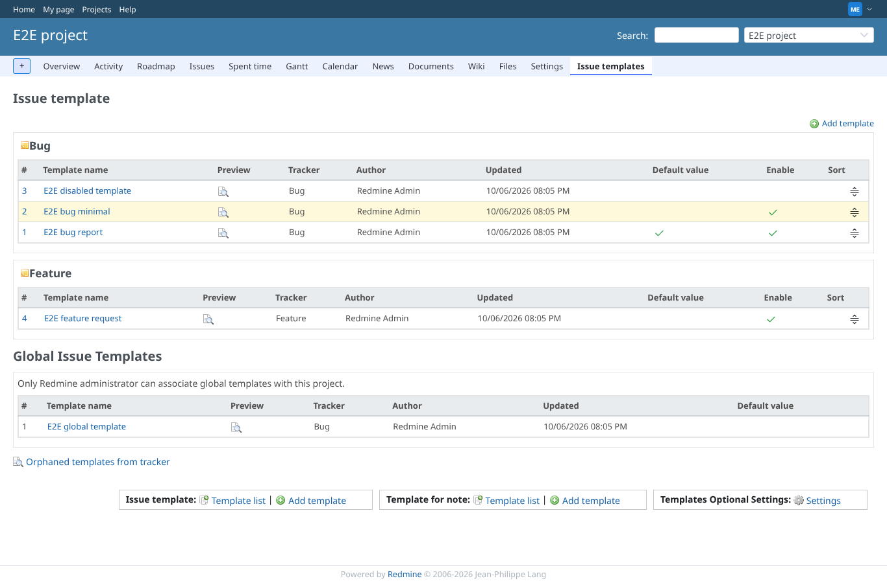
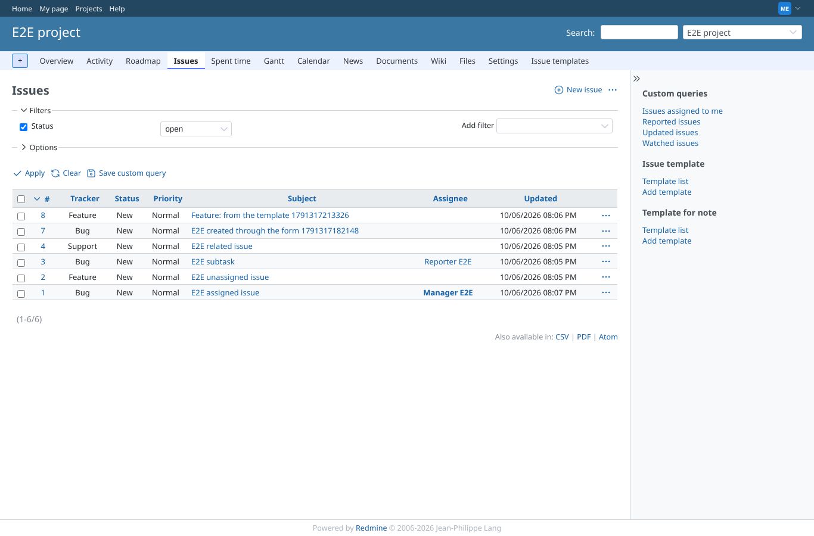
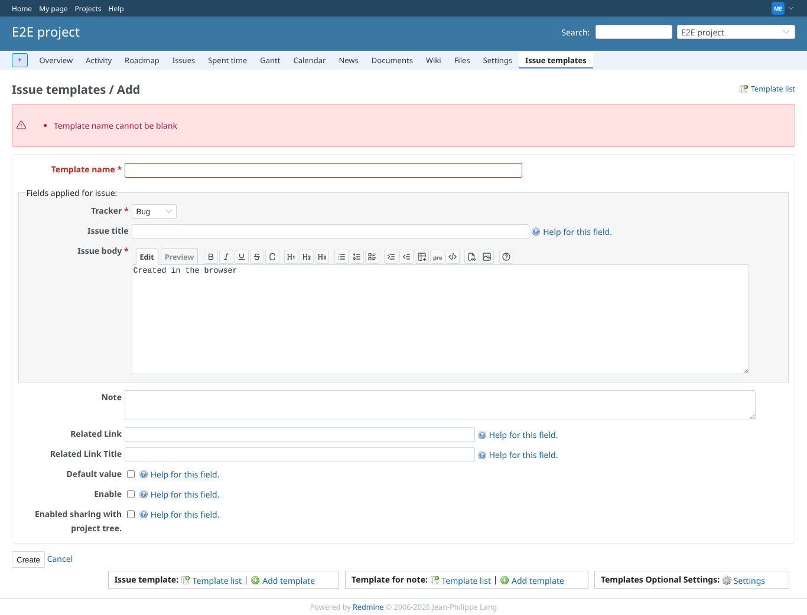
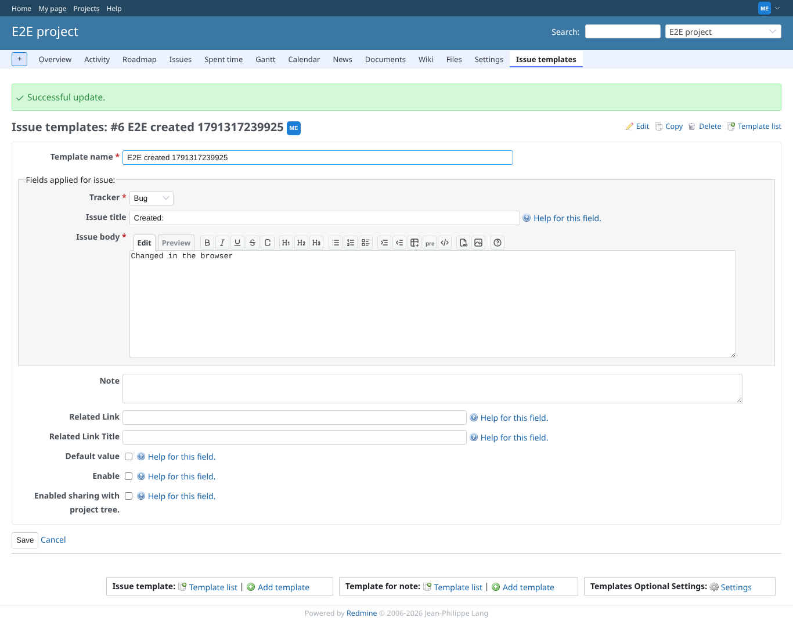
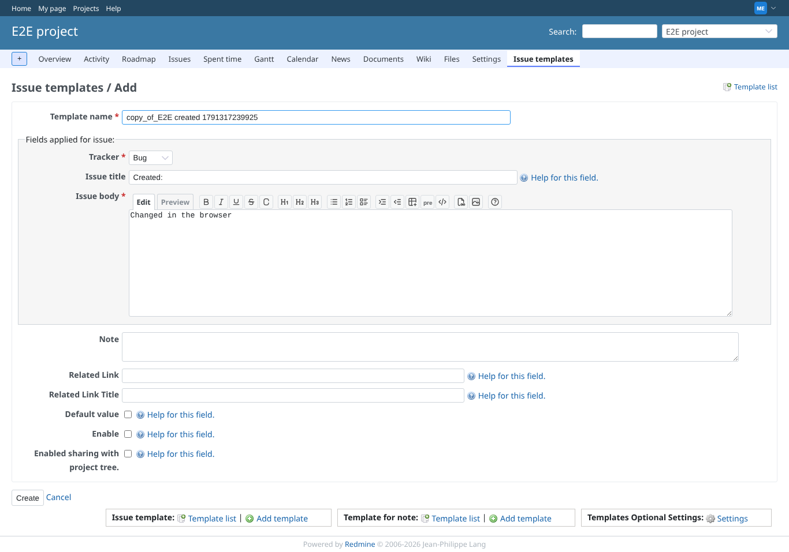
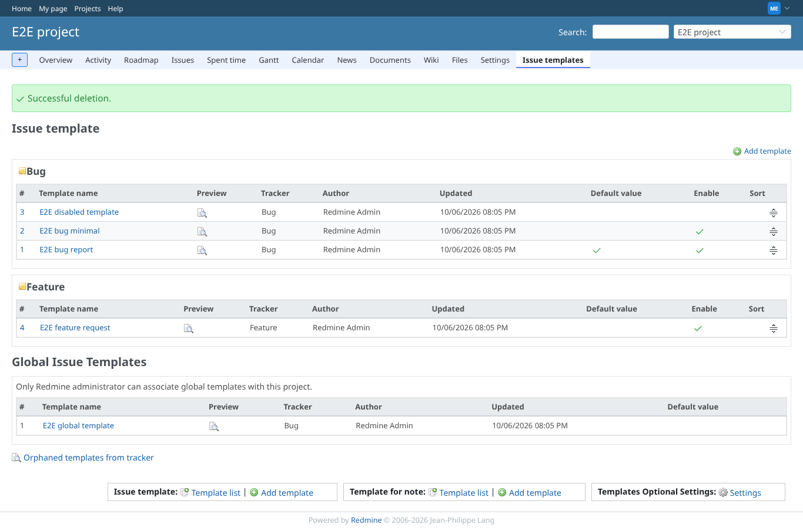
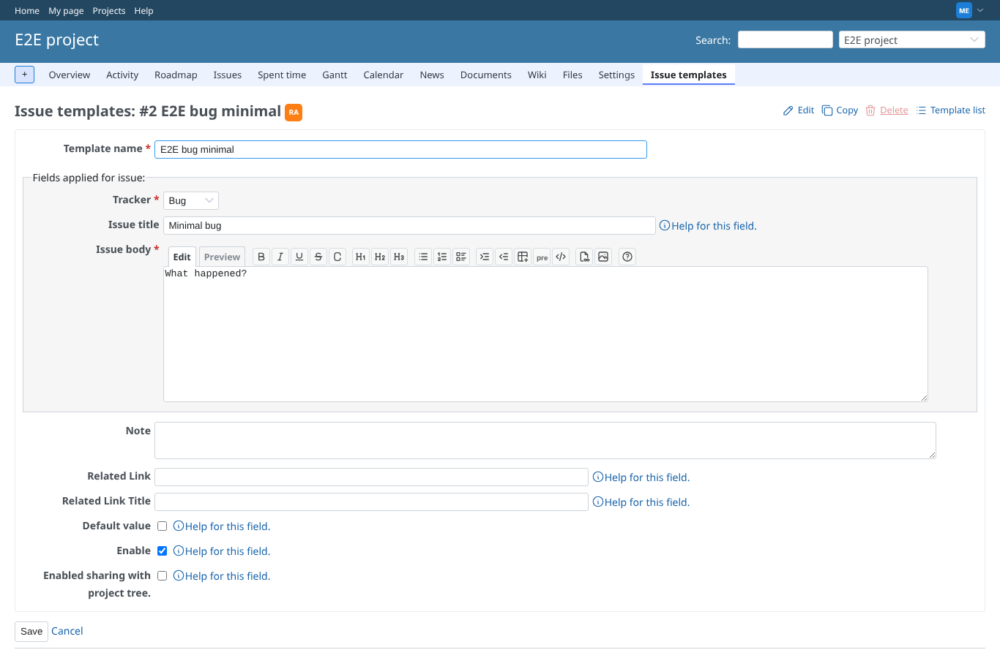
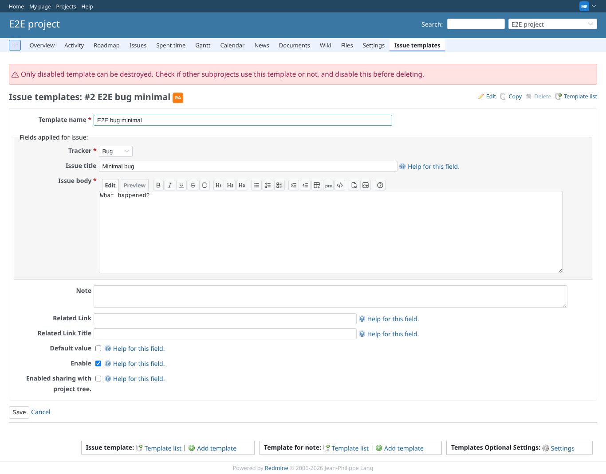
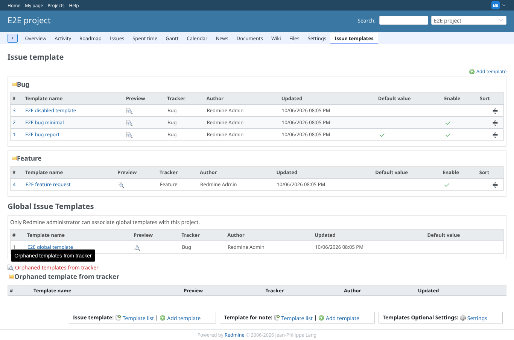
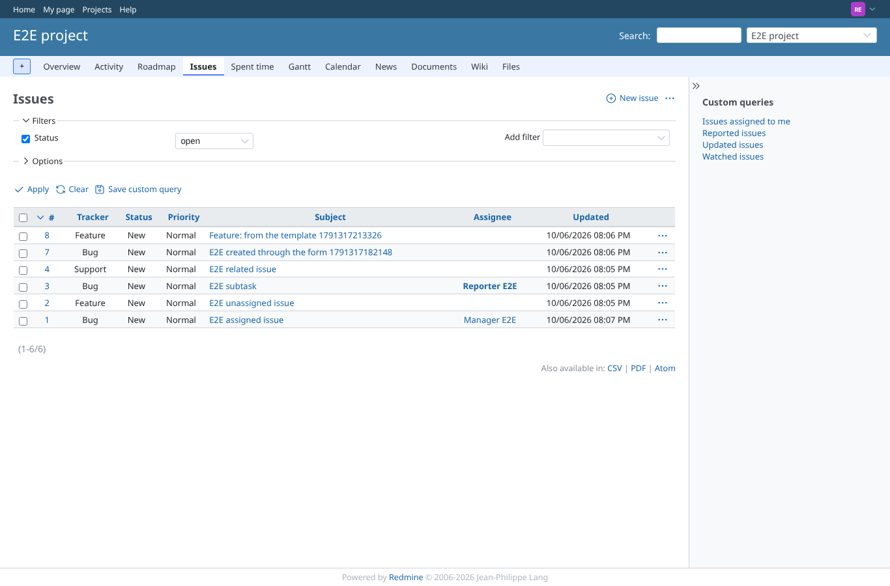

# project-issue-templates

Run 2026-10-06T20:07:33.581Z against http://127.0.0.1:3000.

| screenshot | user | URL | shows |
|---|---|---|---|
|  | manager | `/projects/e2e-project/issue_templates` | The project's templates per tracker, with the global templates for this project below |
|  | manager | `/projects/e2e-project/issues` | The issue list sidebar links to the issue and note templates |
|  | manager | `/projects/e2e-project/issue_templates` | Creating a template without a name is refused with a validation message |
|  | manager | `/projects/e2e-project/issue_templates/6` | The new template is saved and shown |
|  | manager | `/projects/e2e-project/issue_templates/6` | Editing saves the new description; the template is now disabled |
|  | manager | `/projects/e2e-project/issue_templates/new?copy_from=6` | Copy opens a new template form filled from the template, named copy_of_... |
|  | manager | `/projects/e2e-project/issue_templates` | A disabled template is deleted after confirmation |
|  | manager | `/projects/e2e-project/issue_templates/2` | For an enabled template the Delete link is disabled (its tooltip says only disabled templates can be deleted) |
|  | manager | `/projects/e2e-project/issue_templates/2` | Sending the delete anyway is refused: the enabled template stays, the error says to disable it first |
|  | manager | `/projects/e2e-project/issue_templates` | The orphaned templates list (templates of trackers no longer in the project): none here |
|  | manager | `/projects/e2e-project/issue_templates/5` | A template of another project is not reachable through this project's URL (404) |
|  | reporter | `/projects/e2e-project/issue_templates` | Without show_issue_templates the template list is refused (403) |
|  | reporter | `/projects/e2e-project/issues` | Without the permission the issue list sidebar has no template links |
|  | outsider | `/projects/e2e-private/issue_templates` | A non-member is refused the private project's templates (403) |
