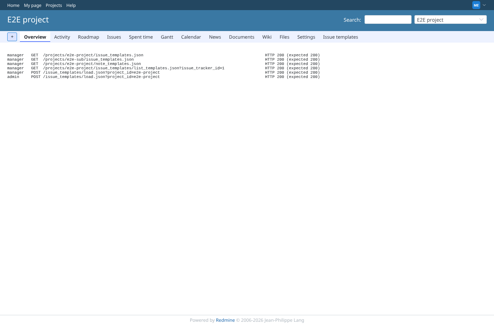
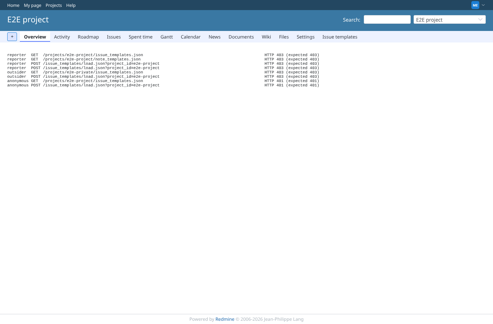

# rest-api

Run 2026-10-07T17:14:15.835Z against http://127.0.0.1:3000.

| screenshot | user | URL | shows |
|---|---|---|---|
|  | manager | `/projects/e2e-project` | With an API key of a member with the permission: the lists (also the inherited templates of the subproject), list_templates and load answer 200 with the templates |
|  | manager | `/projects/e2e-project` | Without the permission, without membership or without a key the same calls are refused (403/401) and return no template text; load used to answer 200 to anyone |
